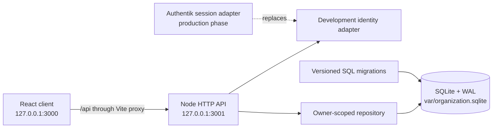

# organization

A self-hosted personal organization app for getting responsibilities out of your head and into a calm visual plan.

`organization` is now an active development application. It runs locally with a React client, a small HTTP API, and a durable SQLite database. Production packaging and integration with `organization.singha.io` are intentionally deferred.

## Current application

- Capture undated work in the persistent **Someday** inbox.
- Plan and reorganize actions across week, month, and year views.
- Open an Action Page for title, date, color, notes, and completion.
- Drag actions within a day or between dates without losing their order.
- Record real completion timestamps for the Activity view.
- Keep every record scoped to a server-resolved owner.

The product language and interaction decisions are maintained in [docs/product.md](./docs/product.md).

## Architecture



The browser never chooses the data owner. During local development, the server resolves one explicitly configured development identity. Production startup is refused until that adapter is replaced with verified Authentik session data.

SQLite is embedded in the application process and runs in WAL mode with foreign keys, a busy timeout, strict tables, and versioned migrations. The database file is runtime state and is not committed.

## Run locally

Requirements: Node.js 24.15 or newer and npm.

```bash
npm install
npm run dev
```

Open [http://127.0.0.1:3000](http://127.0.0.1:3000). The command starts both the Vite client and the local API, with live reload for each.

The default development identity is Rudra. Override it or the database location with the variables documented in [.env.example](./.env.example). Environment files are ignored.

## Development commands

| Command | Purpose |
| --- | --- |
| `npm run dev` | Start the client and API together |
| `npm run dev:web` | Start only the Vite client |
| `npm run dev:api` | Start only the API with restart-on-change |
| `npm run check` | Type-check client and server |
| `npm test` | Exercise the SQLite action lifecycle in an isolated database |
| `npm run build` | Validate and compile the browser application |

## Repository map

```text
organization/
├── docs/                 product direction and decisions
├── migrations/           ordered SQLite schema migrations
├── scripts/              local development orchestration
├── src/
│   ├── client/           React interface and API client
│   ├── server/           HTTP API, identity boundary, and repositories
│   └── shared/           client/server data contracts
├── var/                  ignored local database state
├── index.html
├── package.json
└── vite.config.ts
```

## Deliberate development boundary

This phase does not contain a Dockerfile, reverse-proxy configuration, domain routing, or a production identity adapter. Those belong to the later deployment phase, after the application model and development workflow are stable.
