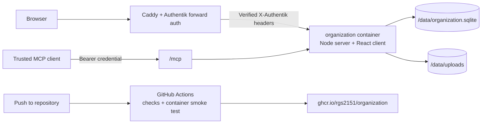

# organization

A calm, self-hosted system for moving responsibilities out of your head and into a trustworthy visual plan.

The approved Actions experience is frozen as the application foundation. The repository contains the React interface, owner-scoped Node API, SQLite persistence, image storage, application-owned MCP endpoint, production container, and automated GHCR publishing workflow. Journal remains intentionally unavailable while its product model is being designed.

## What it does

- Capture undated work in a persistent **Someday** inbox.
- Schedule and reorder actions across week and month calendars.
- Drag-select actions and move an ordered group in one atomic operation.
- Undo action creation, deletion, movement, completion, and color changes without consuming text-editor history.
- Review a compact year of completion-volume circles.
- Open an Action Page with date, color, completion, and structured notes.
- Write headings, lists, checklists, quotes, code, and image attachments.
- Track only completed actions in a GitHub-inspired yearly Activity heatmap.
- Keep every action and attachment scoped to the authenticated owner.
- Let trusted agents use the same owner-scoped operations through revocable MCP credentials.
- Create and revoke per-client MCP credentials from the in-app Settings page.
- Recover cleanly when a browser returns after sleep, disconnection, or an expired login.

Product language and settled interaction rules live in [docs/product.md](./docs/product.md). The editor contract is documented in [docs/editor.md](./docs/editor.md).

## System shape



The application is one container and one process. The Node server owns the API, serves the compiled React application, applies database migrations on startup, and exposes `/api/health` for orchestration. SQLite uses WAL mode, foreign keys, a busy timeout, strict tables, and ordered SQL migrations.

## Local development

Requirements: Node.js 24.15 or newer and npm.

```bash
npm install
npm run dev
```

Open [http://127.0.0.1:3000](http://127.0.0.1:3000). Development mode runs Vite on port 3000 and the API on port 3001 with an explicit local identity and seeded sample data.

| Command | Purpose |
| --- | --- |
| `npm run dev` | Start the client and API with live reload |
| `npm run check` | Type-check the client and server |
| `npm test` | Test owner isolation, persistence, identity, browser failure classification, and MCP |
| `npm run build` | Compile the browser app and production server |
| `npm start` | Run the compiled single-process application |

Local variables are described in [.env.example](./.env.example). Runtime state under `var/` and all environment files remain outside Git.

## Container

Build and run an isolated local container:

```bash
docker build -t organization:local .
docker run --rm \
  --publish 127.0.0.1:3002:3000 \
  --volume organization-data:/data \
  --env ORGANIZATION_AUTH_MODE=development \
  --env ORGANIZATION_ALLOW_DEVELOPMENT_AUTH=true \
  organization:local
```

Open `http://127.0.0.1:3002`. The explicit development-auth override is only for a loopback-bound local container.

The production image defaults to Authentik proxy authentication, listens on port `3000`, and stores all durable state beneath `/data`. It must be reachable only through the private Docker network behind Caddy; browser routes use Authentik forward auth and `/mcp` uses hashed, revocable credentials managed from **Account → Settings → MCP**. Do not publish the container port directly. See [docs/deployment.md](./docs/deployment.md) and [docs/mcp.md](./docs/mcp.md).

## Automated image publishing

Every repository update runs application checks, builds the container, starts it with an isolated temporary database, verifies both the health endpoint and application shell, and then publishes the image to `ghcr.io/rgs2151/organization`.

Published tags:

- `latest` and `main` for the newest accepted build;
- `sha-<commit>` for an immutable source revision.

The published image includes build provenance and a software bill of materials. The private-server repository consumes it by immutable digest and routes `organization.singha.io` to it.

## Repository map

```text
organization/
├── .github/workflows/    validation and GHCR publishing
├── docs/                 product, editor, and deployment contracts
├── migrations/           ordered SQLite schema migrations
├── scripts/              local development orchestration
├── src/
│   ├── client/           React interface and API client
│   ├── server/           HTTP server, identity, storage, and repositories
│   └── shared/           client/server data contracts
├── Dockerfile            production multi-stage image
├── index.html
├── package.json
└── vite.config.ts
```

## Next phase

The unified MCP currently exposes Actions, Action Page notes, and Activity. Journal tools will be added to the same endpoint only after the Journal data model and guided-reflection contract are approved.
